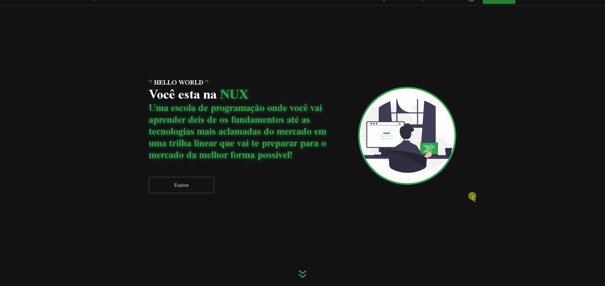

# Nux
<br>
<div align="center">

  🚧 UNDER DEVELOPMENT 🚧 
  


</div>



>thats a landing page of a course made with next and the payment page I use the stripe API, on the styles i have been used styled-component
>FUTURE UPDATES:
>- AUTH JWT
>- Responsivity
>
## 💻 Prerequisites

Before start, make sure you meet these requirements:

* You have installed the latest stable version of `REACT` 

## 🚀 Project Setup

To install, follow these steps:

Clone the project and run the command in the root directory:
```
npm install
```

## ☕ Using Pokédex

### Compiles and hot-reloads for development
```
npm run dev
```

### Compiles and minifies for production
```
npm run build
```

### Lints and fixes files
```
npm run lint
```
## 📫 Contributing for NUX

To contribute, follow these steps:

1. Fork this repository.
2. Create a branch with your feature name: `git checkout -b mynewfeature`.
3. Make your changes and confirm: `git commit -m 'messagehere'`
4. Push your change to the original branch: `git push origin mynewfeature`
5. Create the pull request.


[⬆ Go back to the top!](#Nux)
